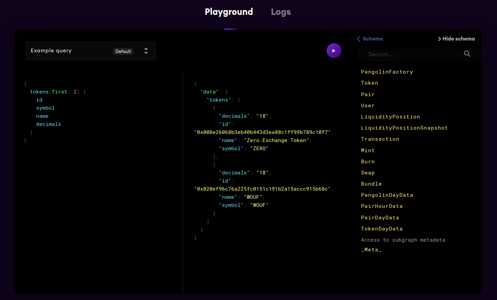
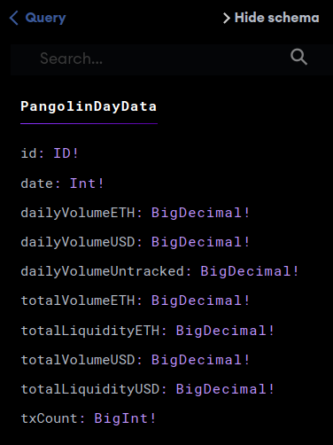
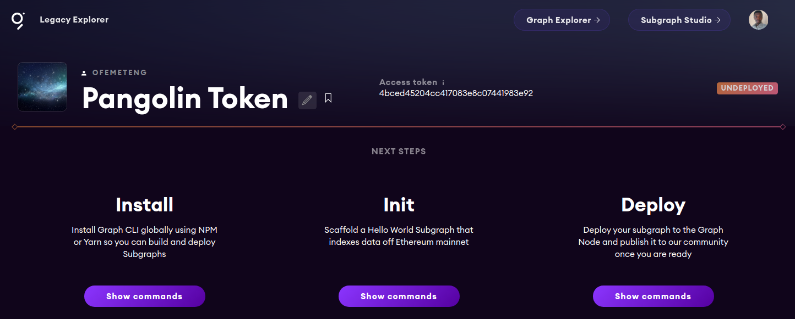
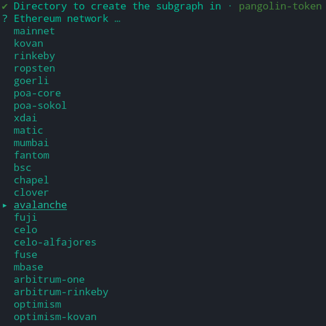
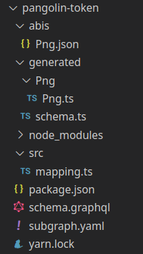

## How to Use The Graph to Query EZChain Data

### Table of Content

* [Introduction](#introduction)
* [What is The Graph](#what-is-the-graph)
* [The Graph and Open APIs](#the-graph-and-open-apis)
* [GraphQL Introduction](#graphql-introduction)
* [What is EZChain](#what-is-ezchain)
* [The Graph and EZChain](#the-graph-and-ezchain)
* [Interacting with EZChain Data via the Graph: Pangolin Example](#interacting-with-ezchain-data-via-the-graph-pangolin-example)
* [How to Build a Subgraph](#how-to-build-a-subgraph)
* [How to Deploy a Subgraph](#how-to-deploy-a-subgraph)
* [Conclusion](#conclusion)

### Introduction

The importance of data is nowadays encapsulated by the saying, “data is the new oil”. What this means is that properly harnessed data is now an invaluable part of any economic strategy, information gathering, or decision-making process as insights gleaned from data can open up productive opportunities and serve as a competitive advantage. The new economy that is being created by the innovation of [blockchain](https://en.wikipedia.org/wiki/Blockchain) technology is no exception. Blockchain data is notoriously difficult to index and query as there isn’t an inbuilt query language as with traditional databases. Thankfully, breakthroughs and new approaches are being made in this space to facilitate data accessibility. One of such protocols that seek to simplify the handling of blockchain data is [The Graph](https://thegraph.com/). In this tutorial, you will be taught how to query data from [EZChain](https://www.ezchain.com/) blockchain using The Graph. EZChain is a next-generation blockchain that lays emphasis on being incredibly fast, low-cost, and scalable. It is also eco-friendly as it relies on a novel approach to consensus, more on this later. The layout of this tutorial is divided into three broad logical sections. First, you will be introduced to The Graph protocol, its mission of creating open APIs standards, and the underlying query language it utilizes, [GraphQL](https://graphql.org/). Second, you will be given an overview of EZChain, how it differs from competitor blockchains, and its design decisions that aid developer onboarding and satisfaction. Third, you will be shown how to tie the concepts learned from The Graph and EZChain to develop a sound data strategy that enables efficient querying of EZChain data in your EZChain applications. By the end of this tutorial, you will be well vested with the knowledge required to create your own data-driven EZChain applications.

### What is The Graph

The Graph is an open-source protocol for indexing and querying blockchain data. The main value proposition of The Graph is to enable anyone to create open APIs that power a decentralized future. Unlike traditional APIs in the Web2 world which are often centralized, proprietary, and have gatekeepers that restrict access, The Graph envisions an open ecosystem of APIs where one API can be built on top of another without needing permission. This can be achieved through the usage of [subgraphs](https://thegraph.com/explorer) which can be thought of as APIs assembled through The Graph that index specific data and exposes querying capabilities to other users. The network of various subgraphs exposes a global graph that provides access to public information in an open and transparent way.

The Graph is currently made up of two types of services, a [hosted service](https://thegraph.com/legacy-explorer/), and a [decentralized Graph network](https://thegraph.com/explorer/network). The hosted service is free to use and supports a wide range of blockchains like EZChain, Ethereum, Fantom, Polygon, Binance Smart Chain (BSC), etc. alongside several testnets of the aforementioned chains. The decentralized Graph network on the other hand currently only supports Ethereum, however, the long-term vision is to have it support other chains as in the hosted service. The main difference between both is that the hosted service is a centralized offering where the nodes are run and maintained by The Graph’s own team, whereas the Graph network is a decentralized offering in which members of the public can operate nodes that support and guarantee the security of the network in a permissionless manner. The token of The Graph decentralized network is GRT (The Graph) and various actors in the ecosystem are incentivized through token inflation to bootstrap the network. Developers can create subgraphs and have indexers run nodes that index those subgraphs, just as curators can signal or support reliable subgraphs through their tokens while delegators who may be non-technical can still contribute to the network by delegating their token to indexers (those who run nodes). The decentralized network is thus more censorship-resistant than the hosted service and as it matures in production, it will eventually support other blockchains apart from Ethereum and eclipse the hosted service which came first.

If you look under the hood of The Graph protocol, you will discover that the hosted service and the decentralized Graph network both rely on an open-source implementation of a [Graph Node](https://github.com/graphprotocol/graph-node). The Graph  Node is a software that can be run which deterministically stores events triggered from blockchains such as Ethereum in a data store. For the initial implementation, the data store used was [PostgreSQL](https://www.postgresql.org/),  and a Graph Node is usually expected to be run alongside an [IPFS](https://ipfs.io/) node and a full node capable of validating all data from that blockchain, for example, an Ethereum full node. With the hosted service, you do not need to run these nodes as they are managed for you. As a result, the hosted service is a great place to start using The Graph and all examples in this tutorial will use the hosted service.

### The Graph and Open APIs

In this section of the tutorial, you will be shown the integral pieces of The Graph protocol, how they fit together and what a typical workflow looks like.


Source: [https://github.com/graphprotocol/graph-node/blob/master/docs/getting-started.md](https://github.com/graphprotocol/graph-node/blob/master/docs/getting-started.md)

The schematic diagram above is an overview of a DApp using The Graph protocol and it contains the components and typical workflow involved. At the center is the Graph Node which was talked about in the last section, it listens to events triggered by smart contracts on the blockchain that it indexes and records those events as data in a store through a predefined mapping (the [WASM](https://webassembly.org/) module) that transforms that data into the desired format. The Graph Node exposes a GraphQL API that the DApp can use to query data from the blockchain it wants to display in the frontend. When such queries are received, Graph Node retrieves the relevant data from the attached store and serves the requests. Note that transactions in the DApp are initiated directly on the smart contracts on the blockchain and do not pass through Graph Node as there is no write capability. The Graph protocol is used to index and query historic data so it can be seen as having a read-only mechanism. However, as a  result of its architecture, caching, and storage, data is queried efficiently since relevant events were indexed earlier. This is a much better approach than having DApps query the blockchain directly to read historic data.

To better understand the workflow of The Graph protocol, it can be easier to think of it as being made up of three components, the Graph Node, the [Graph CLI](https://github.com/graphprotocol/graph-cli), and the [Graph Typescript Library](https://github.com/graphprotocol/graph-ts). The Graph Node has been explained extensively above, the Graph CLI is a Command Line Interface through which you can interact with The Graph protocol and do things like create a subgraph, unregister a subgraph, generate scripts for smart contracts to be indexed, deploy a subgraph to the Graph Node, etc. The Graph TypeScript Library provides a set of helper APIs for you to access the underlying store, blockchain data, smart contracts, IPFS files, cryptographic functions, etc. It can be thought of as providing a connector/mapping from one domain to the other. \
The entry point of a subgraph project is the manifest file. It contains the general definitions of the subgraph such as the smart contract(s) being indexed, the names of events of interest, the handler functions that are triggered on those events,  etc. Other important files that make up a subgraph project are the GraphQL schema file, the mappings file that contains code that dictates how entities are accessed and stored, and a bunch of other auto-generated files which you will understand in-depth in subsequent sections. For now, the most important thing to understand is that the Graph protocol exposes blockchain data via GraphQL APIs, and it does this through an internal mapping of that data to a local store.

### GraphQL Introduction

GraphQL is a query language for APIs and it solves some of the pain points associated with traditional APIs that use the [REST](https://en.wikipedia.org/wiki/Representational_state_transfer) framework. With GraphQL, data can be gotten from different resources in a single request as there is no need for multiple round trips to different endpoints to fetch data. GraphQL also enables frontend clients to describe and request exactly the data they are interested in unlike REST APIs where data that may not be required by the client is returned simply because it is a part of that endpoint. GraphQL uses a single endpoint to serve requests as it relies on the concept of types and fields so your APIs can evolve without the need for explicit versioning, rather new fields, and types can be added. This decouples API design from the frontend structure as APIs can be developed independently and frontends can ask for only data they are interested in with guarantees that they will receive that data if they follow the schema provided by the GraphQL API.

GraphQL defines three [operation types](https://graphql.org/learn/schema/) namely Query, Mutation, and Subscription. In this tutorial, you will concentrate on the [features of GraphQL as relates to The Graph](https://thegraph.com/docs/developer/graphql-api). The Graph only supports the Query type, which as the name implies is used for querying (retrieving) data. Mutations represent actions that can change or update data and are not supported as DApp developers are expected to interact directly with the underlying blockchain through transactions. Subscriptions are used for maintaining an existing connection from a client to a GraphQL server and are not supported by The Graph.

In GraphQL, the Query type is the entry point to the API, The Graph defines an Entity type for its schema but automatically creates the Query type as the top-level type (root type) for you with fields - entity and entities. Below is an example.

```graphql
type Token @entity {
  id: ID!
  address: Bytes!
  name: String!
  symbol: String
}
```

The entity in this example is Token, the @entity directive is provided by The Graph and will create fields token and tokens in the automatically generated Query type. Note that these fields generated are what will be used in constructing a GraphQL query as you will see shortly. The fields in the Token entity - id, address, name, symbol are the data that will be returned if they are included as part of a query. An entity must also include an id field for it to be considered valid. The exclamation mark indicates that the field is NON NULLABLE, which means it will always have a value.

By looking at the GraphQL schema above, you can construct a query that closely mirrors it and includes only the data you are interested in. An example query is shown below.

```graphql
{
  token(id: "1") {
    id
    address
  }
}
```

The example query is for a specific token entity with an `id` of `1`. When querying for a single entity in The Graph, the `id` field must be included. The result returned will mirror the query structure and will only include data requested for which in this case is the `id` and `address` fields. A  probable result is shown below.

```graphql
{
  "data": {
    "token": {
    "id": "0x10",
    "address": "0xc02aaa39b223fe8d0a0e5c4f27ead9083c756cc2"
   }
  }
}
```

You can also query for all tokens (entities) using the query below.

```graphql
{
  tokens {
    id
    address
    name
    symbol
  }
}
```

The results will match the query structure and will be an array of tokens with the additional fields - `name` and `symbol` included because they were requested for unlike in the last query example.

```graphql
{
  "data": {
    "tokens": [
      {
        "id": "0x10",
        "address": "0xc02aaa39b223fe8d0a0e5c4f27ead9083c756cc2",
        "name": "Wrapped Ether",
        "symbol": "WETH"
      },
      {
        "id": "0x11",
        "address": "0x2260fac5e5542a773aa44fbcfedf7c193bc2c599",
        "name": "Wrapped BTC",
        "symbol": "WBTC"
      }
    ]
  }
}
```

The Graph also includes support for sorting, pagination, filtering, time-travel queries, etc. please refer to [The Graph documentation](https://thegraph.com/docs/developer/graphql-api) for a full list of features.

### What is EZChain

EZChain can best be described as a blockchain ecosystem and smart contracts platform that is built from the ground up to combat the notion that blockchains are inherently slow and not scalable. The architecture of EZChain is comprised of [3 main chains](https://docs.ezchain.com/learn/platform-overview) which derive their security guarantees from the [primary network](https://support.ezchain.com/en/articles/4135650-what-is-the-primary-network). The chains are the [Exchange Chain (X-Chain)](https://docs.ezchain.com/build/ezcgo-apis/x-chain), the [Platform Chain (P-Chain)](https://docs.ezchain.com/build/ezcgo-apis/p-chain), and the [Contract Chain (C-Chain)](https://docs.ezchain.com/build/ezcgo-apis/c-chain). The Exchange Chain is used for creating and trading digital assets and relies on EZChain Consensus Protocol, the Platform Chain is used for creating new [subnets](https://docs.ezchain.com/build/tutorials/platform/create-a-subnet) and custom blockchains. The Contract Chain is an instance of the [Ethereum Virtual Machine (EVM)](https://ethereum.org/en/developers/docs/evm/) running on EZChain. Both the Platform Chain and the Contract Chain use the [Snowman Consensus Protocol](https://docs.ezchain.com/#snowman-consensus-protocol). EZChain, therefore supports Ethereum tooling and [Solidity](https://docs.soliditylang.org/en/v0.8.7/) as smart contracts built for Ethereum can be deployed on the Contract Chain with the added benefit of increased throughput. Decentralized applications can also be built natively for the Contract Chain using tools like [MetaMask](https://metamask.io/), [Truffle](https://www.trufflesuite.com/), [Waffle](https://getwaffle.io/), [Remix](https://remix.ethereum.org/). etc. For more explanations about concepts in EZChain, you can consult the official [documentation](https://docs.ezchain.com/).

Below is a diagram that further illustrates the points discussed.


Source: [https://docs.ezchain.com/learn/platform-overview](https://docs.ezchain.com/learn/platform-overview)

### The Graph and EZChain

In line with The Graph’s vision of providing open access to the world’s data and EZChain’s goal of being an open, programmable, smart contracts platform that powers the next wave of scalable decentralized applications, both entities [announced a partnership](https://medium.com/ezchainezc/ezchain-integrates-the-graph-to-bring-its-querying-and-indexing-to-ezchain-536e48043486) that allows on-chain data from EZChain to be indexed and queried through The Graph protocol. This means that Web3 developers can now access EZChain data through subgraphs and build data-intensive applications while also having access to data from other blockchains supported by The Graph protocol.

### Interacting with EZChain Data via the Graph: Pangolin Example

In this section, you will learn how to query EZChain data from an already deployed subgraph on The Graph’s [hosted service](https://thegraph.com/legacy-explorer/). The subgraph you will use indexes data from the [Pangolin](https://pangolin.exchange/) decentralized exchange on EZChain. Pangolin is an [Automated Market Maker (AMM)](https://support.ezchain.com/en/articles/4840276-what-is-an-automated-market-maker-amm) on EZChain, similar in operation to [Uniswap](https://uniswap.org/). It can be used to swap Ethereum and EZChain assets and has fast settlement times and low transaction fees. The Graph’s hosted service provides a playground for deployed subgraphs. The playground is an IDE-like environment based on [GraphiQL](https://github.com/graphql/graphiql) where you can write sample queries to fetch data supported by a subgraph. It is a valuable tool when getting to know the queries that are supported by third-party subgraphs deployed by various projects. The Pangolin exchange subgraph can be accessed [here](https://thegraph.com/legacy-explorer/subgraph/dasconnor/pangolin-dex?selected=playground). Below is an image of the playground interface.



Source: [https://thegraph.com/legacy-explorer/subgraph/dasconnor/pangolin-dex?selected=playground](https://thegraph.com/legacy-explorer/subgraph/dasconnor/pangolin-dex?selected=playground)

The playground consists of the 3 sections, the query section, the results section, and the schema section. You can modify queries, click on the play button and have the returned data displayed in the middle section (results section). The schema section enables you to go through the entities and their associated fields to know what kind of queries are supported by that particular subgraph. Below is an example query you can initiate on the Pangolin exchange subgraph.

```graphql
{
  tokens(first: 2) {
    id
    symbol
    name
    decimals
  }
}
```

The query above is asking for the first 2 tokens from the results of the Pangolin exchange subgraph and it is interested in the fields - `id`, `symbol`, `name`, and `decimals`. The returned result is shown below.

```graphql
{
  "data": {
    "tokens": [
      {
        "decimals": "18",
        "id": "0x008e26068b3eb40b443d3ea88c1ff99b789c10f7",
        "name": "Zero.Exchange Token",
        "symbol": "ZERO"
      },
      {
        "decimals": "18",
        "id": "0x020ef96c76a225fc0151c191b2a15accc915b68c",
        "name": "WOUF",
        "symbol": "WOUF"
      }
    ]
  }
}
```

Using the schema, you can browse through the Pangolin API to discover other entities you are interested in. For example, you can construct a query to know the daily volume on Pangolin and the number of transactions carried out on the [DEX](https://support.ezchain.com/en/articles/4587136-what-is-a-decentralized-exchange-dex).

```graphql
{
  pangolinDayDatas(first: 3, orderBy: date) {
    date
    txCount
    dailyVolumeETH
    dailyVolumeUSD
  }
}
```

The query above will request the data from the first 3 days and only the fields specified will be returned.

```graphql
{
  "data": {
    "pangolinDayDatas": [
      {
        "dailyVolumeETH": "0",
        "dailyVolumeUSD": "0",
        "date": 1612742400,
        "txCount": "2"
      },
      {
        "dailyVolumeETH": "52995.55027820444446352341877709734",
        "dailyVolumeUSD": "1497153.144890008456466344638128839",
        "date": 1612828800,
        "txCount": "3603"
      },
      {
        "dailyVolumeETH": "381001.9576775585402832922123431514",
        "dailyVolumeUSD": "15686187.55247135303384368066876295",
        "date": 1612915200,
        "txCount": "12447"
      }
    ]
  }
}
```

The result shows that there was no volume on the first day but the volume and the number of transactions increased steadily from the second day to the third day.

More data can be gotten from this particular entity by constructing queries that match the fields supported. These fields can be identified from the schema as shown in the image below.



Source: [https://thegraph.com/legacy-explorer/subgraph/dasconnor/pangolin-dex?selected=playground](https://thegraph.com/legacy-explorer/subgraph/dasconnor/pangolin-dex?selected=playground)

You can also interact with a deployed subgraph programmatically from your frontend application. To do this, you will need a GraphQL client like [Apollo](https://www.apollographql.com/docs/) that will act as a communication layer between your application and The Graph. First, open up a terminal in your project folder and install Apollo and GraphQL. You can use either  [NPM](https://www.npmjs.com/) or [Yarn](https://yarnpkg.com/) to install both using the commands below like so.

```npm install @apollo/client graphql```

```yarn add @apollo/client graphql```

Then get the API URL from the subgraph you want to use. The API URL can be gotten from The Graph explorer page of the deployed subgraph. In the Pangolin example which you have been working on, the API URL for HTTP queries is [https://api.thegraph.com/subgraphs/name/dasconnor/pangolin-dex](https://api.thegraph.com/subgraphs/name/dasconnor/pangolin-dex).

Import Apollo client to your project’s code, construct a query according to the schema of the subgraph you are querying and issue the query using your instantiated Apollo client. A code snippet demonstrating this is shown below.

```javascript
import { ApolloClient, InMemoryCache, gql } from '@apollo/client';

const APIURL = "https://api.thegraph.com/subgraphs/name/dasconnor/pangolin-dex";

const tokensQuery = `
  query {
    tokens (first: 5) {
      id
      symbol
      name
      decimals
    }
  }
`

const client = new ApolloClient({
  uri: APIURL,
  cache: new InMemoryCache()
});

client.query({
  query: gql(tokensQuery)
})
.then(data => console.log("Subgraph data: ", data))
.catch(err => { console.log("Error fetching data: ", err) });
```

For a full reference on how to use Apollo Client, kindly consult the official [documentation](https://www.apollographql.com/docs/react/).

### How to Build a Subgraph

In the previous section, you were shown how to integrate an already deployed subgraph into your project. In the next two sections, you will go a step further to define your subgraph, build it and deploy it to the hosted service.

Follow the instructions below to begin the process.

* The first thing to do is to sign in to the [hosted service](https://thegraph.com/legacy-explorer/) if you already have an account. If you do not have an account, you will be required to create one using your [GitHub](https://github.com/) profile.
* Next, click on your GitHub profile picture at the top right-hand corner to access the Dashboard menu item.
* Once on the Dashboard click on the Add Subgraph button.
* Next, on the Create a Subgraph page, input relevant details like your subgraph name, subtitle, description, GitHub URL, etc. then create the subgraph.
* You will be presented with a page containing instructions on the next steps. Do not worry about these as you will perform them in this section.



The subgraph project you will build will be based on the governance token of the Pangolin exchange [PNG](https://snowtrace.io/address/0x60781C2586D68229fde47564546784ab3fACA982/transactions). It will be a simple project with a single entity - `Transfer`, which will be used to track Transfer events of the token. At the end of building this project, you will have hands-on experience of how the various pieces fit together in a Graph project.

First, you need to install Graph CLI as you will use it to interact with The Graph from your terminal. Install it using NPM or Yarn with the commands below.

`npm install -g @graphprotocol/graph-cli`

`yarn global add @graphprotocol/graph-cli`

Next, you will initialize a scaffold project using Graph CLI like so.

`graph init --product hosted-service <GITHUB_USER>/<SUBGRAPH NAME>`

Replace the variables in the command above with your GitHub username and the name of the subgraph you created in the earlier steps. Note that if your subgraph name contains spaces, it will be concatenated with dashes and will be in lowercase. So `Pangolin Token` will become `pangolin-token`.

You will be prompted in the terminal to answer some questions such as the subgraph name, the directory to create the subgraph, the blockchain network, etc. Do not forget to switch the network to EZChain.



In a typical workflow where you are building your own smart contracts for EZChain Contract Chain, you will supply your deployed smart contract address when prompted to do so in the terminal. The smart contract serves as the data source for your subgraph. In our example, we will use the Pangolin token which is already deployed on EZChain. Do note that if The Graph fails to automatically detect your deployed smart contract address from the online block explorer, you will be required to provide a path to the contract’s Application Binary Interface (ABI) file. If it is a project you are building you can generate the ABI files from your Solidity code. If it is an external project, you can download the source code from the project’s GitHub repository and generate the ABI files locally. Alternatively, you can copy the ABI of the deployed contract from [EZChain Contract Chain Explorer](https://snowtrace.io/) into a file. However, this is not the recommended approach as the version you find on the Contract Chain Explorer may not be the latest, also you run the risk of erroneously copying a malicious ABI. If you must copy the ABI from the explorer, make sure you get the contract address from the project’s documentation. For Pangolin token, you can find it [here](https://pangolin.exchange/tutorials/getting-started). Copy the Pangolin token ABI from the Contract Chain Explorer [code tab](https://snowtrace.io/address/0x60781C2586D68229fde47564546784ab3fACA982/contracts), save it in a file with the name Png.json and provide the file path to the Graph CLI when asked if you run into issues with automatic detection from the contract address. Provide the value Png for the contract name when prompted by the CLI. The Graph CLI will generate a scaffolding containing several files and the supplied ABI. Below is what the generated file structure looks like.



The `subgraph.yaml` file is the main entry point to your subgraph project, it contains the subgraph manifest.

```yaml
specVersion: 0.0.2
schema:
  file: ./schema.graphql
dataSources:
  - kind: ethereum/contract
    name: Png
    network: ezchain
    source:
      address: "0x60781C2586D68229fde47564546784ab3fACA982"
      abi: Png
    mapping:
      kind: ethereum/events
      apiVersion: 0.0.4
      language: wasm/assemblyscript
      entities:
        - Transfer
      abis:
        - name: Png
          file: ./abis/Png.json
      eventHandlers:
        - event: Transfer(indexed address,indexed address,uint256)
          handler: handleTransfer
      file: ./src/mapping.ts
```

The `dataSources` field on the subgraph.yaml file specifies the smart contract of interest. The value of the `abi` field under the `source` field must match the value of the `name` field under `abis`. The value under entities is the name of the GraphQL entity that you will create. The `eventHandlers` field currently contains one event and the associated function that will be triggered to handle it. This file was generated from the ABI file for the Pangolin token. Other events exposed by the ABI have been removed for simplicity. The file `schema.graphql` contains The Graph entities and is referenced in the `subgrpah.yaml` file. Below is the content of the file.

```graphql
type Transfer @entity {
  id: ID!
  from: Bytes! # address
  to: Bytes! # address
  amount: BigInt!
}
```

The content contains one entity - `Transfer` indicated by the `@entity` directive. The fields that may up the entity are `id`, `from`, `to`, `address`. Notice that these fields closely mirror the event signature of the Transfer event of the Pangolin token. The fields have their type specified and all are NON NULLABLE as indicated by the exclamation mark. 

The next important piece is the [AssemblyScript](https://www.assemblyscript.org/) Mappings. AssemblyScript is used to transform data from the blockchain’s events and GraphQL entities into a format that can be loaded on The Graph Node. Before writing your event handler mapping for the `Transfer` event in the `mappings.ts` file under the `src` folder, you will need to generate the AssemblyScript classes from your ABI and `schema.graphql` file. Run the command below to do so.

`graph codegen`

Whenever you make changes to your GraphQL schema or your subgraph manifest, you will be required to regenerate the mappings using the command above. It is considered best practice to regenerate your mappings often as they can become a source of errors if you forget to do so.

Back in the `mappings.ts` file, you will import the generated classes from the Pangolin token ABI and the GraphQL schema. Next, the `handleTransfer` function will take in a `Transfer` event, parse its contents, and store it in the Graph Node. Remember that a blockchain event is always associated with a handler function that is triggered whenever the said event occurs. Below is the `mappings.ts` file for the Transfer event.

```typescript
// Import the Transfer event class generated from the Png ABI
import { Transfer as TransferEvent } from "../generated/Png/Png"

// Import the Transfer entity type generated from the GraphQL schema
import { Transfer } from "../generated/schema"

// Transfer event handler
export function handleTransfer(event: TransferEvent): void {
  // Create a Transfer entity, using the hexadecimal string representation
  // of the transaction hash as the entity ID
  let id = event.transaction.hash.toHex()
  let transfer = new Transfer(id)

  // Set properties on the entity, using the event parameters
  transfer.from = event.params.from
  transfer.to = event.params.to
  transfer.amount = event.params.amount

  // Save the entity to the store
  transfer.save()
}
```

You can now build the subgraph project to make sure you do not have any errors. Run the build command like so.

`graph build`

If your subgraph builds successfully, you are ready for deployment.

### How to Deploy a Subgraph

To deploy a subgraph you must authenticate with the hosted service using your access token. Your access token can be seen from your project’s dashboard. You can authenticate by running the command below.

`graph auth --product hosted-service <ACCESS_TOKEN>`

The final step is to run the deployment command below and replace the variables with your details.

`graph deploy --product hosted-service <GITHUB_USER>/<SUBGRAPH NAME>`

This initiates the deployment process and you should see your subgraph being uploaded to IPFS. After a while the upload is complete. You can now switch to your project dashboard on the hosted service. Your subgraph will have a status of syncing as it indexes the event of interest from the genesis block of the blockchain. If you want indexing to start at a specific block, you can specify it in the `startBlock` field under the `source` field in your `subgraph.yaml` file. For a full list of options for the subgraph manifest look at the official [documentation](https://thegraph.com/docs/developer/create-subgraph-hosted#the-subgraph-manifest).


Source: [https://thegraph.com/legacy-explorer/subgraph/ofemeteng/pangolin-token](https://thegraph.com/legacy-explorer/subgraph/ofemeteng/pangolin-token)

Depending on the amount of data that is being indexed by the subgraph, the syncing period may take longer. Once the subgraph has synced fully without errors, you can query the supported entities through the playground or by integrating the queries endpoint in your project using a framework like Apollo.

You can try issuing the query below on your deployed Pangolin Token subgraph from the playground.

```graphql
{
  transfers(first: 3) {
    id
    from
    to
    amount
  }
}
```

The results return the first 3 transfer events from the subgraph as expected.

```graphql
{
  "data": {
    "transfers": [
      {
        "amount": "46649696040618800000",
        "from": "0xeed2db9b2d2645aaca044ecb397518ca6d9e74a5",
        "id": "0x000296c30c325db75de48101737f5d54408af486ab021323225767701429e66e",
        "to": "0xd7538cabbf8605bde1f4901b47b8d42c61de0367"
      },
      {
        "amount": "1766396909474367721",
        "from": "0xbb67987c040619842b0f8b0257bde63be842b27b",
        "id": "0x000308522c9a2266f4ac73e13f02e7496decbad08286d52642ee768ff7ef343e",
        "to": "0xd7538cabbf8605bde1f4901b47b8d42c61de0367"
      },
      {
        "amount": "6826187345560538842",
        "from": "0xa16381eae6285123c323a665d4d99a6bcfaac307",
        "id": "0x0003aba174d1ad02e24d07122bb8bd66d194b640f79b19f3290885f2952b7b2b",
        "to": "0x063b88d53d109c12ec21785c4e5e89bb71369432"
      }
    ]
  }
}
```

You can find the full code for the Pangolin Token subgraph in this [Github repository](https://github.com/ofemeteng/pangolin-token-subgraph).

### Conclusion

Congratulations on getting to the end of this tutorial. That was an extensive tour of The Graph and EZChain ecosystems. In this tutorial, you were introduced to the concepts underpinning The Graph protocol and how it is set to bring about a new era of open APIs through which developers can build on the work of others in an open, decentralized, and permissionless manner. You were also introduced to GraphQL, the query language that powers The Graph protocol. The unique tweaks of The Graph protocol as relates to GraphQL were also highlighted and it was shown that The Graph currently only supports the Query type in the GraphQL specification. Next, you were introduced to the EZChain blockchain, which was designed specifically to solve some of the scaling issues currently being experienced by other Layer 1 blockchain networks. EZChain architecture and design choices were highlighted. Even though EZChain operates based on a novel consensus algorithm, its Contract Chain which is one of 3 chains that make up the EZChain ecosystem is EVM compatible. This means that developers from Ethereum and other EVM-based chains can use tools that they are already familiar with. EZChain support for Solidity also means that DApps built for these chains can be deployed on EZChain and immediately reap the benefits associated with low transfer fees and increased throughput. You were also shown how to use The Graph protocol to query data from EZChain. The playground provided by The Graph was used to interact with the Pangolin decentralized exchange subgraph and you were also introduced to Apollo Client through which you can programmatically interact with subgraphs via your frontend projects. Finally, you built your own subgraph from scratch and deployed it on the hosted service by leveraging the governance token of Pangolin.

At this point, you should be well equipped with the knowledge and tools you need to build awesome data-based projects using The Graph and EZChain. Happy BUIDLing.
